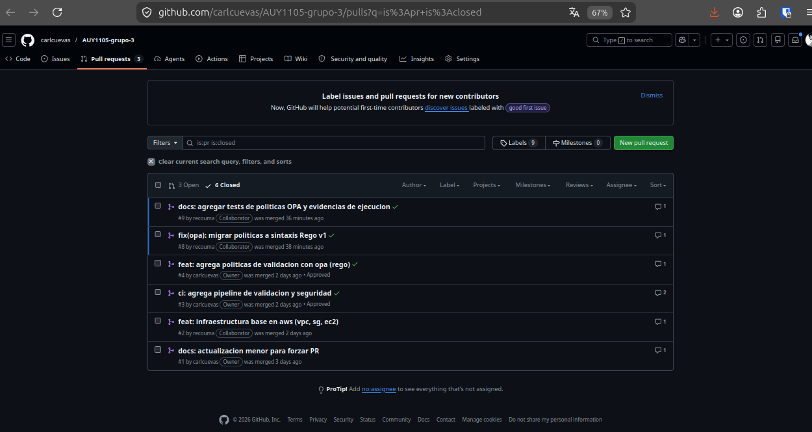
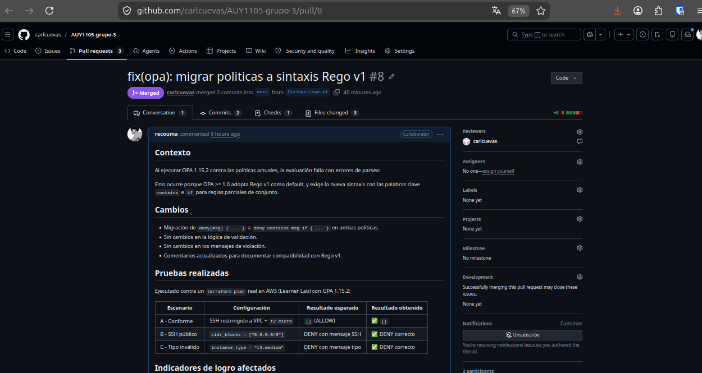
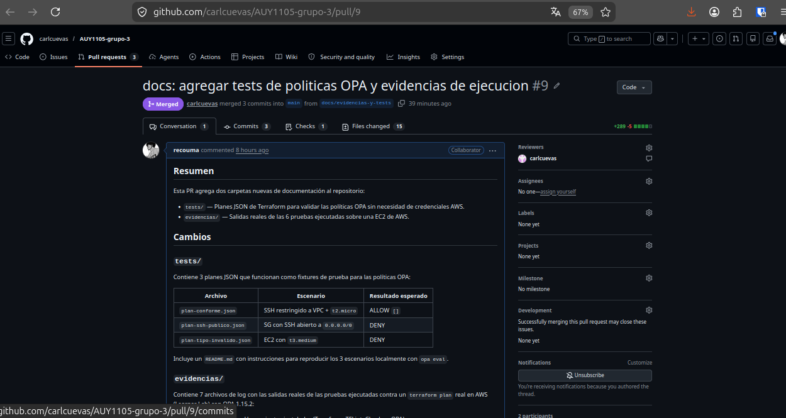
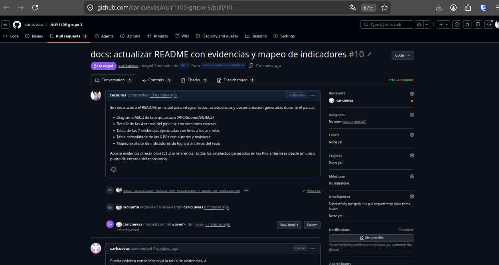
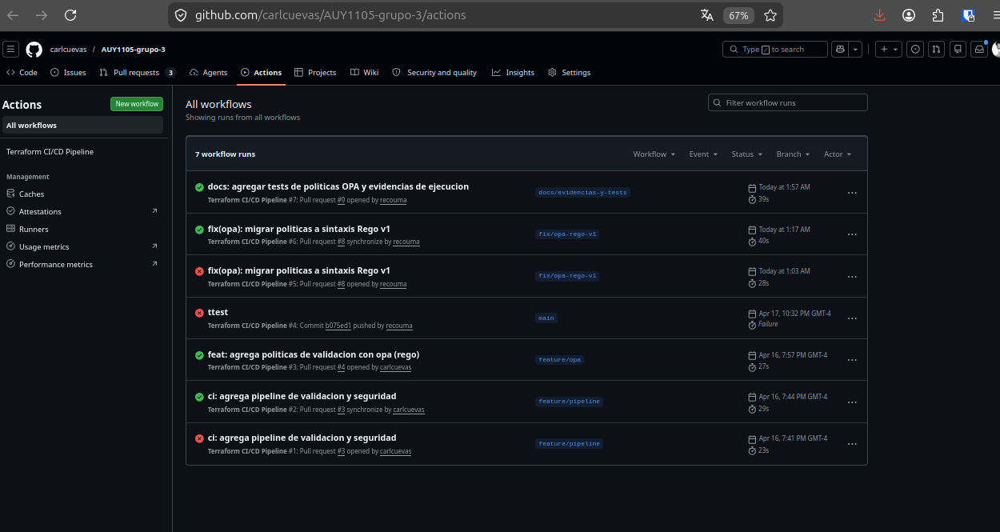

  
  
  
  
  

# AUY1105 - Infraestructura como Código II
## Evaluación Parcial 1: Automatización de Análisis de Calidad y Seguridad

**Grupo 3** - Integrantes:
* Carlos Rodrigo Cuevas Núñez — [@carlcuevas](https://github.com/carlcuevas)
* Daniel Tapia Sobarzo — [@recouma](https://github.com/recouma)

---

## 📑 Tabla de Contenidos

1. [Propósito del Proyecto](#-propósito-del-proyecto)
2. [Arquitectura de Infraestructura](#-arquitectura-de-infraestructura)
3. [Pipeline de CI/CD](#-pipeline-de-cicd)
4. [Políticas de Seguridad (OPA)](#-políticas-de-seguridad-opa)
5. [Evidencias de Pruebas Ejecutadas](#-evidencias-de-pruebas-ejecutadas)
6. [Evidencias de Revisión (Pull Requests)](#-evidencias-de-revisión-pull-requests)
7. [Estructura del Proyecto](#-estructura-del-proyecto)

---

## 🎯 Propósito del Proyecto

El objetivo principal es desplegar una infraestructura base en AWS siguiendo el paradigma de **GitOps**. Se prioriza la seguridad mediante el análisis estático de código y la aplicación de políticas como código (PaC) antes de realizar cualquier cambio en el entorno principal.

---

## 🏗️ Arquitectura de Infraestructura

La infraestructura se despliega en la región `us-east-1` bajo la nomenclatura `AUY1105-proyecto1-*`:

| Recurso | Configuración | Propósito |
| :--- | :--- | :--- |
| **VPC** | CIDR `10.1.0.0/16` | Aislamiento de red para el proyecto |
| **Subnet** | CIDR `10.1.1.0/24` | Segmento de red público para cómputo |
| **Security Group** | Puerto 22 (TCP) restringido a la VPC | Control de acceso perimetral |
| **EC2 Instance** | `t2.micro` con Ubuntu 24.04 LTS | Servidor de aplicaciones base |
┌─────────────────────────────────────────┐
│  VPC  10.1.0.0/16                       │
│  ┌─────────────────────────────────┐    │
│  │  Subnet  10.1.1.0/24            │    │
│  │                                 │    │
│  │  ┌───────────────┐              │    │
│  │  │  EC2          │              │    │
│  │  │  t2.micro     │◄── SG:22/tcp │    │
│  │  │  Ubuntu 24.04 │    (VPC only)│    │
│  │  └───────────────┘              │    │
│  └─────────────────────────────────┘    │
└─────────────────────────────────────────┘

---

## ⚙️ Pipeline de CI/CD

Se utiliza **GitHub Actions** para automatizar el ciclo de vida del código. El flujo se dispara en cada **Pull Request** hacia la rama `main` y ejecuta 4 etapas secuenciales:
┌─────────────┐   ┌─────────────┐   ┌──────────────┐   ┌─────────┐
│   TFLint    │──►│   Checkov   │──►│ TF Validate  │──►│   OPA   │
│ (estático)  │   │ (seguridad) │   │ (sintáctico) │   │(policy) │
└─────────────┘   └─────────────┘   └──────────────┘   └─────────┘

**Etapa 1 — TFLint** `v0.53.0`: análisis estático de mejores prácticas Terraform.

**Etapa 2 — Checkov** (Bridgecrew, Prisma Cloud): escaneo de 19 checks de seguridad AWS. Se excluyen con `skip_check` 9 checks de best practices fuera del scope del parcial (monitoring, EBS encryption, IAM roles, VPC flow logs).

**Etapa 3 — `terraform validate`**: validación sintáctica y coherencia interna.

**Etapa 4 — OPA 1.15.2**: evaluación de políticas declarativas en Rego v1 contra el `terraform plan`.

---

## 🛡️ Políticas de Seguridad (OPA)

Para garantizar el cumplimiento normativo implementamos políticas mediante **Open Policy Agent** en lenguaje Rego v1:

| Política | Archivo | Criterio de denegación |
| :--- | :--- | :--- |
| **Restricción SSH** | `policies/denegar_public_ssh.rego` | Deniega Security Groups con puerto 22 abierto a `0.0.0.0/0` |
| **Tipos de instancia** | `policies/solo_t2_micro.rego` | Deniega EC2 con `instance_type != t2.micro` |

Los 3 escenarios de prueba versionados están en la carpeta `tests/` con instrucciones de reproducción.

---

## 📊 Evidencias de Pruebas Ejecutadas

Todas las pruebas fueron ejecutadas sobre una EC2 Amazon Linux 2023 en AWS Learner Lab, con `terraform plan` real. Las salidas completas están en la carpeta `evidencias/`:

| # | Prueba | Archivo | Resultado |
| :---: | :--- | :--- | :--- |
| 0 | Versiones de herramientas | `00-versiones.txt` | Terraform 1.14.8 · TFLint 0.61.0 · Checkov 3.2.521 · OPA 1.15.2 |
| 1 | `terraform validate` | `01-terraform-validate.txt` | ✅ Success |
| 2 | TFLint análisis estático | `02-tflint.txt` | ✅ Exit code 0 |
| 3 | Checkov análisis seguridad | `03-checkov.txt` | 10 PASSED, 9 fuera de scope |
| 4 | **OPA - Plan conforme** | `04-opa-A-conforme.txt` | ✅ `[]` (ALLOW) |
| 5 | **OPA - SSH público** | `05-opa-B-ssh-publico.txt` | ✅ DENY correcto |
| 6 | **OPA - Tipo inválido** | `06-opa-C-tipo-invalido.txt` | ✅ DENY correcto |

---

## 🤝 Evidencias de Revisión (Pull Requests)

Gestión del trabajo colaborativo mediante revisiones cruzadas entre los dos integrantes:

| PR | Título | Autor | Revisor | Estado |
| :---: | :--- | :--- | :--- | :---: |
| #1 | Configuración inicial del repositorio | Carlos | Daniel | Merged |
| #2 | Infraestructura base en AWS | Carlos | Daniel | Merged |
| #3 | Pipeline CI/CD | Carlos | Daniel | Merged |
| #4 | Políticas OPA | Carlos | Daniel | Merged |
| #8 | Fix políticas Rego v1 + ajuste Checkov | **Daniel** | **Carlos** | Merged |
| #9 | Docs: tests OPA y evidencias | **Daniel** | **Carlos** | Merged |

**Total: 6 PRs con reviews cruzadas documentadas** — cumple el mínimo de 2 PRs por integrante exigido por la pauta.

---

## 📂 Estructura del Proyecto
AUY1105-grupo-3/
├── .github/workflows/
│   └── main.yml                         # Pipeline CI/CD (4 etapas)
├── policies/
│   ├── denegar_public_ssh.rego          # OPA: bloquea SSH 0.0.0.0/0
│   └── solo_t2_micro.rego               # OPA: solo t2.micro
├── tests/
│   ├── plan-conforme.json               # Fixture: infra conforme
│   ├── plan-ssh-publico.json            # Fixture: violación SSH
│   ├── plan-tipo-invalido.json          # Fixture: violación tipo
│   └── README.md                        # Instrucciones de pruebas
├── evidencias/
│   ├── 00-versiones.txt
│   ├── 01-terraform-validate.txt
│   ├── 02-tflint.txt
│   ├── 03-checkov.txt
│   ├── 04-opa-A-conforme.txt
│   ├── 05-opa-B-ssh-publico.txt
│   └── 06-opa-C-tipo-invalido.txt
├── .gitignore
├── CHANGELOG.md                         # Historial de versiones
├── main.tf                              # Definición de recursos AWS
└── README.md                            # Este archivo

---

## 🔗 Mapeo con Indicadores de Logro

| Indicador | Evidencia principal en este repo |
| :--- | :--- |
| **IL1.1** — PRs documentadas | Tabla de PRs arriba + comentarios en línea en PR #8 y #9 |
| **IL1.2** — Análisis estático | `evidencias/02-tflint.txt`, `evidencias/03-checkov.txt`, `.github/workflows/main.yml` |
| **IL1.3** — Documentación | Este README + `CHANGELOG.md` + `tests/README.md` + comentarios inline en `main.tf` |
| **IL2.1** — Políticas de seguridad | `policies/*.rego` |
| **IE2.2.1** — Sistema de permisos automatizado | Etapa 4 del workflow |
| **IE2.3.1** — Pruebas de políticas | `tests/` + `evidencias/04-06-*.txt` |

---

## 📷 Capturas de Evidencia Visual

Capturas de pantalla del repositorio y pipeline de GitHub Actions que complementan las evidencias en texto.

### Vista del repositorio

### Pull Requests con revisiones cruzadas

Lista completa de PRs cerradas con autores y revisores visibles:

Detalle de las PRs de Daniel revisadas por Carlos:

**PR #8 — Fix políticas OPA a Rego v1**

**PR #9 — Documentación: tests y evidencias**

**PR #10 — Update README**

### Pipeline de CI/CD (GitHub Actions)

Historial de workflows ejecutados, todos en verde:

